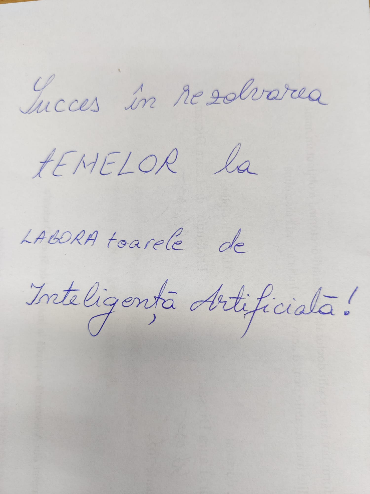
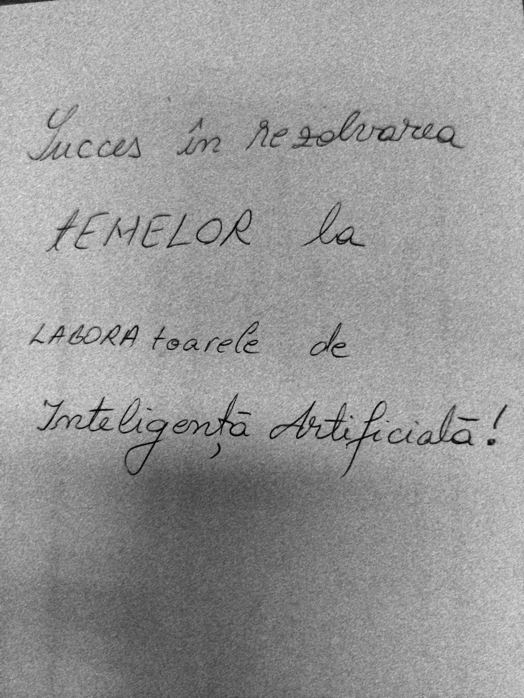

# Project 'Azure OCR'

---

This project was made for the **'Artificial Intelligence'** course in my university.

### There are 3 parts in this project:
- **Text recognition on default images**
- **Text detection** (positioning)
- **Text recognition on modified images** (without noise)

## Text recognition on default images
I used **Azure's Computer Vision** resource to recognize text from images with a paper that has written text in Romanian.

For this image the recognized text by Azure OCR was: 
**Lucces in resolvarea
TEMELOR la
LABORA toarele de
Inteligenta Artificialà!**

### Metrics
- Levenshtein distance
    - CER: 0.08695652173913043
    - WER: 0.6666666666666666
- Jaro distance
    - CER: 0.057971014492753624
    - WER: 0.5555555555555556

## Text detection
I used **Azure's Computer Vision** resource to detect the posioning of each word from the same images.

The result was pretty acurate as you can see in the Jupyter Notebook.

## Text recognition on modified images
I used **Azure's Computer Vision** resource to recognize text from images with a paper that has written text in Romanian **after removing the noise**.

For this image the recognized text by Azure OCR was: 
**Succes in resolvarea
TEMELOR la
LABORA toarele de
Inteligentà Artificialà!**

### Metrics
- Levenshtein distance
  - CER: 0.08695652173913043
  - WER: 0.6666666666666666
- Jaro distance
  - CER: 0.057971014492753624
  - WER: 0.5555555555555556